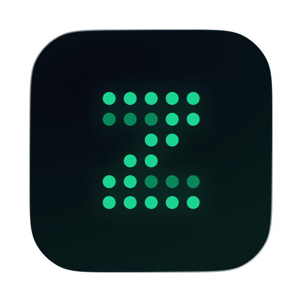
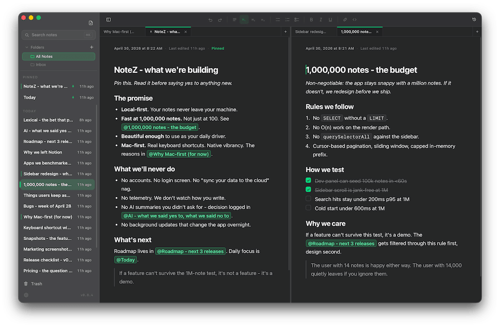
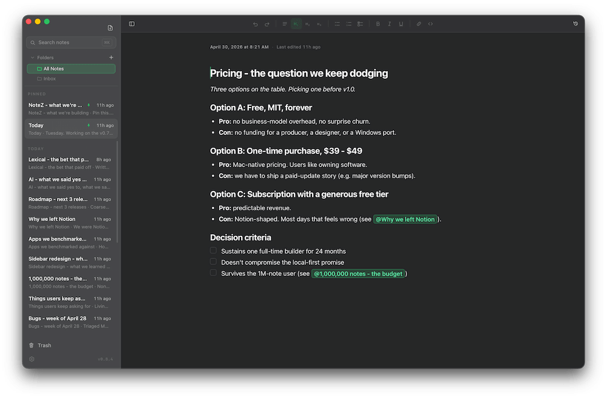
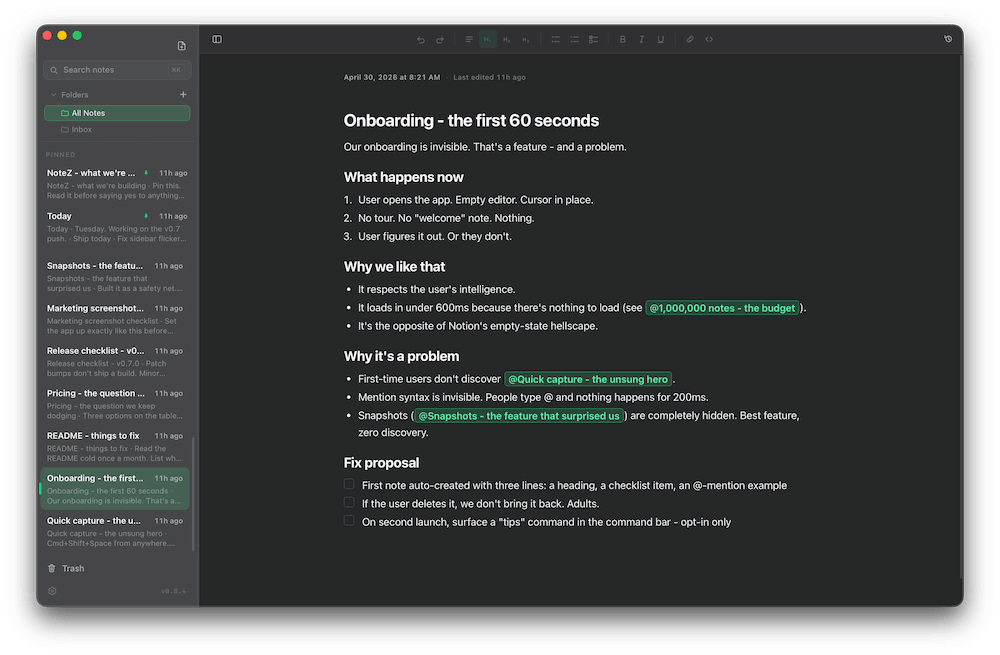

<p align="center">
  
</p>

<h1 align="center">NoteZ</h1>

<p align="center">
  <strong>The note app that stays fast at one million notes.</strong>
</p>

<p align="center">
  <em>Local. Private. Beautiful. Mac-first.</em>
</p>

<p align="center">
  
  
  
  
  
  
</p>

<p align="center">
  
</p>

---

## The pitch in one paragraph

Apple Notes is too simple. Notion is too much. **NoteZ is the middle that
nobody else built.** It opens instantly, searches a hundred thousand notes
in under a fifth of a second, looks like an Apple app because it's built
out of the same materials, and keeps every word you write in a single file
on your Mac. No account. No cloud. No telemetry. No permission to ask
anyone for.

---

## What makes it different

### Built for one million notes, not one hundred

Most note apps are designed around the idea that "a power user has a few
hundred notes." NoteZ assumes the opposite. The performance budget is
**1,000,000 notes** - the sidebar virtualizes, the database paginates with
cursors, the search index is FTS5 with custom BM25 + recency + title +
pin ranking, and folder counts are denormalized so listing is `O(folders)`
no matter how big the corpus gets.

If a feature can't survive the 1M-note test, it doesn't ship. The user
with fourteen notes is happy either way. The user with fourteen thousand
quietly leaves if you ignore them. NoteZ is for both.

### Your notes never leave the machine

Everything lives in **one SQLite file** on your Mac:

```
~/Library/Application Support/de.agent-z.notez/notez.db
```

Back it up however you like. Drop the folder in iCloud Drive or Dropbox to
sync between Macs. Move it to an external drive. Open it with any SQLite
tool to look inside. There is no NoteZ server. There is no account to
make. The only network calls NoteZ ever makes are an hourly check against
GitHub Releases for new versions (no body, no telemetry - just a GET that
asks "is there something newer?") and the optional AI title feature,
which is off by default with the key in your macOS Keychain.

### No Markdown in your face

Type `# ` for a heading and the `# ` disappears. Type `**bold**` and the
asterisks vanish. The shortcuts are there if you want them, but the
screen always shows the finished page - never the source code. Built on
**Lexical** (Meta's editor framework), wired up directly without React.

### Mac-first, properly

Translucent vibrancy sidebar. Hidden traffic lights that blend into the
chrome. Native dark mode that reacts to the system. Global hotkeys that
respect Accessibility permissions. The whole app is around ten megabytes
because it's **Tauri + Rust**, not Electron.

---

## Tour

### Split panes, up to eight

<p align="center">
  
</p>

Drag a note from the sidebar onto an editor edge to split. Hit `Cmd+D` to
split right, `Cmd+Shift+D` to split down. Tile up to eight panes, drag
the dividers to resize, jump between them with `Cmd+1..9`. Your layout
restores itself the next time you launch.

### Folders, drag-and-drop, scoped views

<p align="center">
  
</p>

Group notes into nested folders. Drag notes onto folders, drag folders
into folders. Click a folder to scope the sidebar to it. Inbox holds
everything you haven't filed yet. Deleting a folder asks where the
contents should go - reparent up, reparent into another folder, or move
to trash recursively.

### Mentions that link your thinking

<p align="center">
  
</p>

Type `@` anywhere to link to another note. The popover ranks suggestions
by recency and relevance, fuzzy-matches as you type, and renders the
result as a token - **not** a markdown link. Click the pill to jump.
Build a web of ideas without folders or tags getting in the way.

---

## Features

| | |
|---|---|
| **Spotlight-style search** | Press `Cmd+K` to open a command bar over everything. Smart ranking: BM25, recency, title hits, pinned bonus. CJK queries work end-to-end (per-character tokenization mirrors the index). |
| **Quick capture** | `Cmd+Shift+N` from anywhere on your Mac opens a tiny capture window. Type, `Cmd+Enter`, saved. |
| **Snapshots** | Every five minutes of editing, NoteZ silently saves a history point. Up to 50 per note. Plus manual snapshots whenever you want one. Roll back with one click. |
| **Trash with retention** | Deleted notes sit in a configurable trash (7 days, 30 days, 6 months, never) before they actually disappear. |
| **Pinned notes** | `Cmd+Shift+P` to pin. Pinned notes get their own section at the top of the sidebar. |
| **Tangible images** | Drag images in, click to select, drag the corner to resize, drag the body to reorder. They're real objects, not embedded HTML. |
| **Backlinks** | Every `@mention` is indexed in both directions. The data is there; the panel ships when it earns its space. |
| **Themes** | Default (dark), Light, Mono. Custom themes are coming next. |
| **AI titles, opt-in** | Optionally let an LLM suggest titles for untitled notes. Off by default. Key in macOS Keychain. Zero AI surface anywhere else in the app. |
| **Per-note cursor memory** | Switch notes, come back, your cursor is exactly where you left it. Survives restarts. |
| **Cmd+Z that actually works** | Full Lexical history per note. No multi-undo bugs. No silent data loss. |
| **Live time labels** | "11h ago" and "Today" headings update without polling, without reflow, without battery cost when the window is hidden. |

---

## Keyboard

| | |
|---|---|
| `Cmd+K` | Search / command bar |
| `Cmd+N` | New note |
| `Cmd+T` | New tab in active pane |
| `Cmd+W` | Close active tab/pane |
| `Cmd+Shift+N` | Quick Capture (system-wide) |
| `Cmd+\` | Toggle sidebar |
| `Cmd+D` | Split pane right |
| `Cmd+Shift+D` | Split pane down |
| `Cmd+1..9` | Focus pane by index |
| `Cmd+Tab` / `Cmd+Shift+Tab` | Cycle tabs in pane |
| `Cmd+Alt+↑` / `Cmd+Alt+↓` | Previous / next note |
| `Cmd+Shift+P` | Pin or unpin current note |
| `Cmd+Shift+H` | Open snapshots for current note |
| `Cmd+Shift+Backspace` | Move note to Trash |
| `@` | Open note-link suggestions |
| `# `, `## `, `### ` | Headings |
| `- ` or `* ` | Bullet list |
| `1. ` | Numbered list |
| `[] ` | Checklist item |
| `**text**` | Bold |
| `_text_` | Italic |
| <code>&#96;code&#96;</code> | Inline code |

Global shortcuts (Search, Quick Capture) are rebindable in Settings.

---

## Install

NoteZ is built for **Apple Silicon Macs**. Grab the latest `.dmg` from
[Releases](https://github.com/ibimspumo/NoteZ/releases).

1. Open the `.dmg` and drag **NoteZ.app** into **Applications**.
2. The app is unsigned (no Apple Developer account yet), so macOS Gatekeeper
   will block it on first launch. Run this once in Terminal to clear the
   quarantine flag:

   ```bash
   xattr -cr /Applications/NoteZ.app
   ```

3. Open NoteZ from Applications. It will launch normally from now on.

If you skip step 2, you'll see *"NoteZ is damaged and can't be opened"* or
*"cannot be opened because the developer cannot be verified"*. That's
macOS, not the app. The `xattr` command is safe - it just removes the
quarantine attribute that Safari/Finder added to the download.

### Updating

Once installed, NoteZ checks GitHub Releases once an hour for newer
versions. When one is available, a small green **Update available** pill
appears in the sidebar footer. Click it to download the new version in
the background while you keep writing - the pill turns into its own
progress bar, then flips to **Restart to apply** when the bundle is on
disk. Click that to relaunch immediately, or just quit NoteZ normally
and the new version starts on the next launch.

In Settings → Updates you can flip auto-download to **On**: the hourly
check then fetches and unpacks the new version silently, so the only
manual step is the eventual restart (or just keep using NoteZ until you
quit it for any reason). Off by default; the choice is yours.

The `xattr` step is only needed for the *first* install - in-app
updates skip Gatekeeper because the bundle never goes through Safari or
Finder.

The hourly check is the only background network call NoteZ makes. No
payload is sent, no identifier, no telemetry. Disconnecting from the
internet just means the pill never appears; the app keeps working.

---

## Promises

- **No accounts.** Ever.
- **No cloud.** Your notes never touch a server we control.
- **No telemetry.** We don't watch how you write, when you write, or whether you write at all.
- **No forced updates.** Updates are checked once an hour against GitHub Releases. Downloading and applying happens on your terms - either by clicking the sidebar pill, or by opting in to background download in Settings. The check sends no data.
- **No AI surprises.** The one optional AI feature is opt-in, key-local, and clearly labeled.
- **No lock-in.** It's a SQLite file. You own it.

---

## Built with

Tauri 2 + Rust on the back, Solid + TypeScript on the front, Lexical for
the editor, SQLite (FTS5) for storage and search. No Electron. No React.
The whole app is around ten megabytes.

For development setup, see [CLAUDE.md](CLAUDE.md).

---

## License

MIT. Take it. Read it. Fork it. Ship it.
